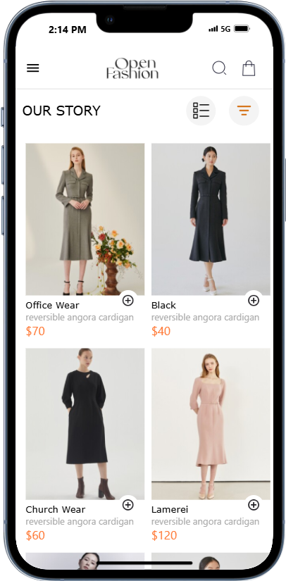
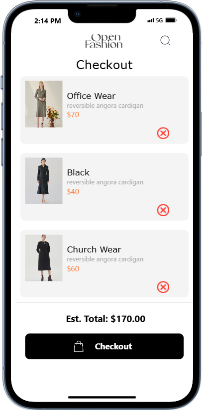

# 11020486-rn-assignment6
## clothingApp

This React Native application is a simple e-commerce app that allows users to browse items, add them to a cart, and view the items in the cart with their total price. The app includes a home screen and a cart screen, with navigation provided by a drawer navigator.

## Design Choices
### Navigation
The app uses a drawer navigator to switch between the Home screen and the Cart screen. This provides an easy and accessible way for users to navigate between different sections of the app.
### UI Components
#### Custom Header
A custom header is implemented to include a logo and icons for search and cart. This header is shared across different screens, providing a consistent look and feel.
#### Grid Layout
The Home screen displays items in a grid layout, making efficient use of screen space and providing a visually appealing way to showcase products.
#### Data Storage
AsyncStorage: AsyncStorage is used for persistent storage of cart items. This ensures that the cart items are preserved even when the app is closed and reopened.

## Components
### App.js
This is the entry point of the application. It wraps the application in SafeAreaProvider and includes the Navigator component for handling navigation.
### Navigator.js
This component sets up the drawer navigator with the Home and Cart screens. It also defines a custom header for the navigation.
### HomeScreen.js
This component displays a list of products in a grid layout. Users can add items to the cart by clicking the "Add to Cart" button.
### CartScreen.js
This component displays the items in the cart, allows users to remove items, and shows the total price with a "Checkout" button.

## Screenshots of the app on iPhone 13 Pro

